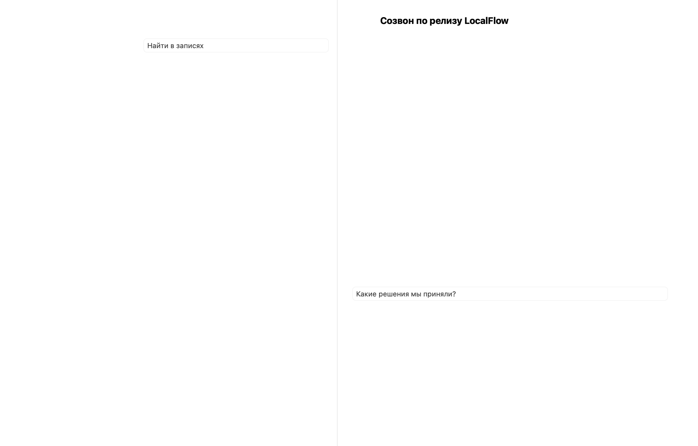

# LocalFlow

**Local-first dictation, voice notes and meeting memory for macOS. Everything runs on your Mac — no cloud APIs, no subscriptions.**

LocalFlow is an open, privacy-first alternative to Wispr Flow built for Apple Silicon. Press **⌘B**, speak anywhere, and get clean, edited text pasted into the field you were typing in. Record calls with one shortcut, keep a voice diary, and ask questions across your own searchable archive — with every model running locally.



## What it does

- **Dictate anywhere (⌘B).** A floating window shows your words live while you speak — stable text plus a dimmed draft tail, a word counter, and a size you can stretch like any window (it remembers position and dimensions). Press ⌘B again and the window stays visible while the transcript is finalized and edited on device, then inserts the result at the cursor and dismisses itself. Escape cancels; the clipboard is restored after pasting. If the target field truly cannot receive text, a small fallback panel keeps the result one click away.
- **Shortcuts you actually like.** Both global shortcuts (dictation and meeting capture) are re-recordable in Settings with live validation: conflicts with each other and system-critical combinations (⌘C/⌘V/⌘X/⌘Q/⌘W/⌘Space/⌘Tab) are rejected, function keys work without modifiers, and ⌘-shortcuts trigger on the left ⌘ only — the right ⌘ keeps reaching applications, so ⌘B still means Bold.
- **Two editing strengths.** *Tidy* removes speech noise while preserving facts, numbers, negations and your tone. *Flowing text* reorganizes a stream of thoughts into coherent paragraphs without inventing anything. A free-form *your style* field tunes both.
- **Voice notes as a quiet diary page.** Create a note, write a title and a line of context, then dictate into it whenever you're ready. Notes can be extended by voice later.
- **One-press meeting capture (⇧⌘M).** Records system audio and your microphone as separate tracks, transcribes both, splits speakers post-hoc, and produces a summary with decisions, open questions and clickable timestamps back into the audio.
- **A memory that is actually yours.** A personal dictionary (heard → preferred spelling) is applied before every edit; familiar voices can be saved and recognized across meetings. Ask the archive a question and every claim comes with a citation and a playable timestamp.
- **Engineered for low load.** Models load on demand and unload automatically after idle (ASR after 2 min, editor after 1 min by default). A dictated sentence edits in ~1–2 s on an M3 Pro; nothing runs in the background while you're silent.

## The models (and why)

All weights are pinned to exact revisions with per-file checksums and downloaded once from their publishers; after that LocalFlow works fully offline.

| Role | Model | Disk |
|---|---|---:|
| Speech recognition (25 languages incl. Russian) | NVIDIA Parakeet TDT 0.6B v3, CoreML on the Neural Engine | 483 MB |
| Text editor & archive answers (default) | Google **Gemma 4 E2B** (4-bit MLX) | 3.6 GB |
| Alternative editor | Qwen3-4B-Instruct-2507 (4-bit MLX) | 2.3 GB |
| Speaker separation | Pyannote Community-1 / WeSpeaker (CoreML) | 22 MB |

The editor was chosen by a measured bake-off on a 10-case Russian dictation corpus ([docs/benchmarks](docs/benchmarks)): Gemma 4 E2B is ~2× faster than Qwen3-4B (0.32 s first token, ~76 tok/s) at equal or better fact preservation, and correctly handles self-corrections like *"send 12 files, not 15"*. Qwen3.5-4B was disqualified for silently changing meaning. Both remaining editors are selectable in Settings.

**Safety rails.** Every edited draft passes deterministic guards (number multisets, negation counts, corrected-number patterns, length ratios). A suspicious edit is never silently trusted: the minimal deterministic cleanup is delivered instead, and the model's proposal is kept as a separate version. The original transcript is always preserved. Archive answers without valid citations are rejected.

## Build & install

Requirements: Apple Silicon Mac, Xcode 26+ with the Metal toolchain, [XcodeGen](https://github.com/yonaskolb/XcodeGen).

```sh
brew install xcodegen
xcodebuild -downloadComponent MetalToolchain
Scripts/build.sh     # xcodegen + xcodebuild Release + local signing
Scripts/test.sh      # 33 unit/interface tests
Scripts/install.sh   # installs to ~/Applications/LocalFlow.app
```

First run: open **Settings → Models**, download the recognizer and editor, grant Microphone and Accessibility (for ⌘B), and — for meeting audio — Screen & System Audio Recording. The app UI is currently in Russian; the codebase and docs are English-friendly and localization is on the roadmap.

The build is signed with a persistent local certificate (stored outside the repo), so permissions survive re-installs on your own Mac. This is not a notarized distribution — see [docs](docs/validation.md) for the honest limitations list.

## Data & privacy

Everything lives in `~/Library/Application Support/LocalFlow/`: a SQLite archive with full-text search (`archive.sqlite`), chunked 30-second audio parts with a crash-safe journal, and checksum-verified model weights. Audio is pruned after 30 days (pinned items are kept), texts stay until you delete them, and there is no telemetry of any kind. Recording survives crashes: transcription is checkpointed per window and resumes where it stopped.

## Repository layout

```
Sources/LocalFlowCore/   engine: audio capture, ASR/LLM/diarization, safety guards, SQLite store
Sources/LocalFlow/       SwiftUI app: overlay panel, archive, diary, settings
Sources/LocalFlowBench/  CLI benchmarking harness (ASR/editor/diarization pipelines)
Sources/LocalFlowShots/  deterministic UI screenshot generator (README images)
Scripts/                 build, test, install, signing, model pinning, editor bake-off
docs/                    architecture, plan, validation log, benchmarks, product strategy
```

## Status & roadmap

v0.2.0 — daily-driver quality for the author's setup (M3 Pro / 18 GB, macOS 26): dictation, notes, meetings, archive Q&A, model choice. Known limits: diarization can merge similar voices; latency targets on real speech are still being measured; calendar/Slack/MCP integrations and mobile are future work. Full details: [docs/plan.md](docs/plan.md), [docs/validation.md](docs/validation.md), [docs/product-strategy.md](docs/product-strategy.md).

## License

Code: [MIT](LICENSE). Model weights keep their publishers' licenses — see [THIRD_PARTY_NOTICES.md](THIRD_PARTY_NOTICES.md).
